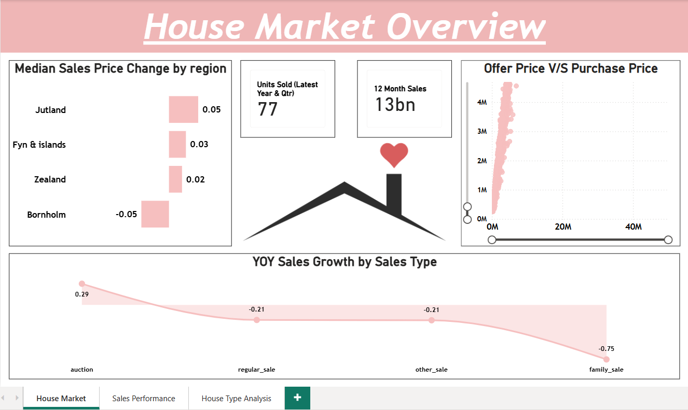
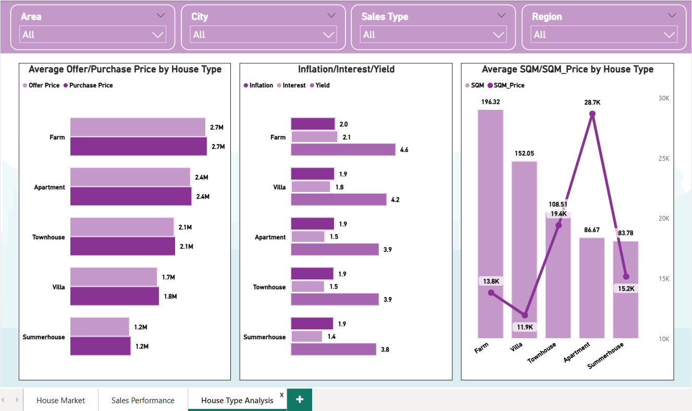

# Housing Market Analysis
Google BigQuery | Power BI | SQL | DAX

## Project Summary

End-to-end housing market analysis using Google BigQuery as a cloud data warehouse and Power BI for analytics and visualization.  
The project focuses on identifying sales trends, pricing behavior, regional performance, and key market drivers to support data-driven real estate decisions.

### Tools & Technologies
- Google BigQuery (Cloud Data Warehouse)
- Power BI Desktop & Power BI Service
- SQL
- DAX
- Power Query

### Key Responsibilities
- Loaded housing data into Google BigQuery and performed SQL-based analysis
- Cleaned and standardized data using Power Query
- Built DAX measures for YoY growth, YTD sales, and rolling 12-month sales
- Designed interactive Power BI dashboards
- Published reports to Power BI Service

### Key Metrics & Analysis
- Year-over-Year (YoY) Sales Growth
- Median Sales Price Change by Region
- Units Sold (Latest Year & Quarter)
- Last 12-Month Sales Performance
- Sales by Region & Sales Type
- Offer Price vs Purchase Price Analysis
- Housing Age & Price Impact

### Dashboard Highlights
- Housing market overview with time-based trends
- Regional and sales-type performance comparison
- Offer vs purchase price analysis
- Key Influencer visual to identify price drivers
- Interactive slicers for user-driven analysis

### Business Insights
- Regional disparities in pricing and sales volume
- Consistent gaps between offer and purchase prices
- Housing age and area strongly influence price
- Clear year-over-year and seasonal trends

### Outcome
Delivered a cloud-based, production-ready Power BI dashboard enabling stakeholders to monitor housing market performance and pricing trends effectively.

### Skills Demonstrated
- Data Analytics & Visualization
- SQL & Cloud Data Warehousing
- Power BI & DAX
- Business Insight & Storytelling

## Report Snapshot (Power BI Desktop)

### Housing Market Overview

### Sales Performance Dashboard

### House Type Analysis

